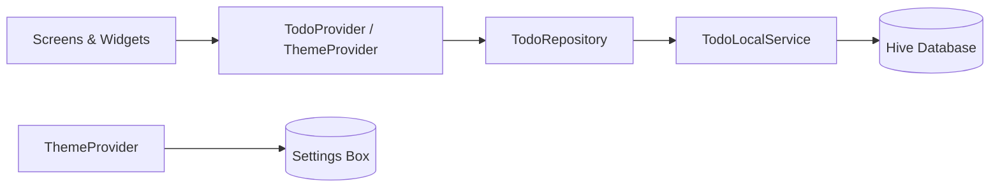

# Todo App

A feature-rich Flutter todo application with local persistence, search, filter, sort, and dark mode support.

---

## Project Overview

This is a **Todo Task Manager** built with Flutter. Users can create, edit, delete, and mark tasks as complete. Tasks support title, description, due date, and priority levels.

The app follows a **layered architecture** with clear separation between UI, state management, business logic, and data storage:

```
UI (Screens/Widgets) → Provider → Repository → Local Service → Hive
```

### Features

- **CRUD operations** — Add, edit, and delete tasks with confirmation dialog
- **Complete / Reopen** — Toggle task status with visual feedback (strikethrough, green tint)
- **Search** — Real-time search on title and description
- **Filter** — All, Pending, Completed, High/Medium/Low Priority
- **Sort** — By created date, due date, priority, or alphabetical order
- **Dark mode** — Light/dark theme toggle with preference saved locally
- **Local storage** — Hive database for offline-first persistence
- **Error handling** — Graceful fallback to in-memory storage if Hive fails
- **Material 3 UI** — Responsive layout, loading states, snackbars, and empty states

---

## Flutter Version Used

| Tool    | Version   |
|---------|-----------|
| Flutter | **3.41.1** (stable) |
| Dart    | **3.11.0** |

> Minimum SDK constraint in `pubspec.yaml`: `^3.11.0`

---

## Packages Used

### Dependencies

| Package           | Version   | Purpose                                      |
|-------------------|-----------|----------------------------------------------|
| `provider`        | ^6.1.5+1  | State management (`TodoProvider`, `ThemeProvider`) |
| `hive`            | ^2.2.3    | Local NoSQL database for todos and settings  |
| `path_provider`   | ^2.1.4    | App documents directory for Hive storage     |
| `intl`            | ^0.20.2   | Date formatting                              |
| `cupertino_icons` | ^1.0.8    | iOS-style icons                              |

### Dev Dependencies

| Package         | Version | Purpose                |
|-----------------|---------|------------------------|
| `flutter_test`  | SDK     | Widget and unit tests  |
| `flutter_lints` | ^6.0.0  | Recommended lint rules |

### Dependency Override

| Package                 | Version | Reason                                              |
|-------------------------|---------|-----------------------------------------------------|
| `path_provider_android` | 2.2.15  | Avoids JNI crash (`libdartjni.so`) on some Android devices with 2.3.x |

---

## Project Structure

```
lib/
├── main.dart                    # App entry point, Hive init, providers setup
├── app.dart                     # MaterialApp with theme configuration
│
├── constants/
│   ├── app_constants.dart       # App name, Hive box names, copy strings
│   ├── app_spacing.dart         # Shared spacing and radius values
│   └── app_theme.dart           # Light and dark Material 3 themes
│
├── core/
│   ├── errors/
│   │   └── app_exception.dart   # Custom exception types
│   └── result/
│       └── operation_result.dart # Success/failure result wrapper
│
├── models/
│   ├── todo.dart                # Todo model, priority & status enums
│   └── todo_adapter.dart        # Hive type adapter for Todo
│
├── providers/
│   ├── todo_provider.dart       # Todo list state, search/filter/sort
│   └── theme_provider.dart      # Theme mode state
│
├── repository/
│   └── todo_repository.dart     # Abstraction over local data source
│
├── services/
│   ├── hive_service.dart        # Hive initialization
│   ├── todo_local_service.dart  # CRUD operations on Hive box
│   └── theme_storage_service.dart # Persist theme preference
│
├── screens/
│   ├── home/
│   │   └── home_screen.dart     # Task list, search, filter, sort
│   └── todo_form/
│       └── todo_form_screen.dart # Add / edit task form
│
├── widgets/
│   ├── todo_list_item.dart      # Individual task card
│   ├── todo_filter_bar.dart     # Horizontal filter chips
│   ├── todo_search_bar.dart     # Search input
│   ├── todo_sort_button.dart    # Sort options in AppBar
│   ├── todo_empty_state.dart    # Empty and no-results states
│   ├── theme_toggle_button.dart # Dark/light mode toggle
│   ├── delete_todo_dialog.dart  # Delete confirmation
│   ├── priority_chip.dart       # Priority badge
│   ├── status_chip.dart         # Status badge
│   ├── app_error_banner.dart    # Storage error banner with retry
│   ├── app_loading_button.dart  # Button with loading indicator
│   ├── app_loading_view.dart    # Full-screen loading
│   └── responsive_content.dart  # Max-width content wrapper
│
├── utils/
│   ├── todo_validator.dart      # Form validation rules
│   ├── todo_search.dart         # Search logic
│   ├── todo_filter.dart         # Filter logic
│   ├── todo_sort.dart           # Sort logic
│   ├── date_formatter.dart      # Date display helpers
│   ├── error_message.dart       # User-friendly error messages
│   ├── app_snackbar.dart        # Snackbar helper
│   └── app_error_handler.dart   # Global error logging
│
└── routes/
    ├── app_routes.dart          # Route name constants
    └── app_router.dart          # Route generation

test/
├── widget_test.dart             # Home screen widget test
├── todo_validator_test.dart
├── todo_search_test.dart
├── todo_filter_test.dart
├── todo_sort_test.dart
└── error_message_test.dart
```

---

## Setup Instructions

### Prerequisites

1. Install [Flutter SDK](https://docs.flutter.dev/get-started/install) (3.41.1 or compatible with Dart 3.11+)
2. Set up an emulator/simulator or connect a physical device
3. Verify installation:

```bash
flutter doctor
```

### Clone and Install

```bash
git clone <repository-url>
cd todo
flutter pub get
```

No API keys or environment files are required — the app runs fully offline with local Hive storage.

---

## How to Run the Application

### Run on connected device or emulator

```bash
flutter run
```

### Run on a specific platform

```bash
flutter run -d windows    # Windows desktop
flutter run -d chrome     # Web browser
flutter run -d android    # Android device/emulator
```

### Run tests

```bash
flutter test
```

### Build release APK (Android)

```bash
flutter build apk --release
```

---

## Assumptions Made

1. **Single user, single device** — No authentication, cloud sync, or multi-user support.
2. **Offline-first** — All data is stored locally via Hive; no backend API.
3. **Due date validation** — Due date cannot be set in the past when creating or editing a task.
4. **Title is required** — Description is optional.
5. **Default priority** — Medium priority is used when an invalid value is encountered.
6. **Default status** — New tasks are created with `pending` status.
7. **Flat task list** — Tasks are not grouped into sections (e.g. no separate Pending/Completed headers).
8. **FAB visibility** — Floating action button is hidden when the task list is empty; users create the first task via the empty state button.
9. **Theme preference** — Light/dark mode choice is persisted in a separate Hive settings box.
10. **Storage fallback** — If Hive initialization fails, the app continues in in-memory mode and shows an error banner with a retry option.
11. **No notifications** — Reminders or push notifications for due dates are out of scope.
12. **English UI** — All labels and messages are in English.

---

## Screenshots (Optional)

> Add screenshots of your running app here. Suggested captures:

| Screen              | Description                                      |
|---------------------|--------------------------------------------------|
| Home (light mode)   | Task list with search bar and filter chips       |
| Home (dark mode)    | Same screen with dark theme enabled              |
| Empty state         | "No tasks found. Create your first task."        |
| Add / Edit task     | Form with title, description, due date, priority |
| Filter chips        | Pending, Completed, and priority filters         |

Example folder structure:

```
screenshots/
├── home_light.png
├── home_dark.png
├── empty_state.png
└── add_task.png
```

To embed in this README once added:

```markdown


```

---

## Architecture Overview



---

## License

This project is for educational purposes.
